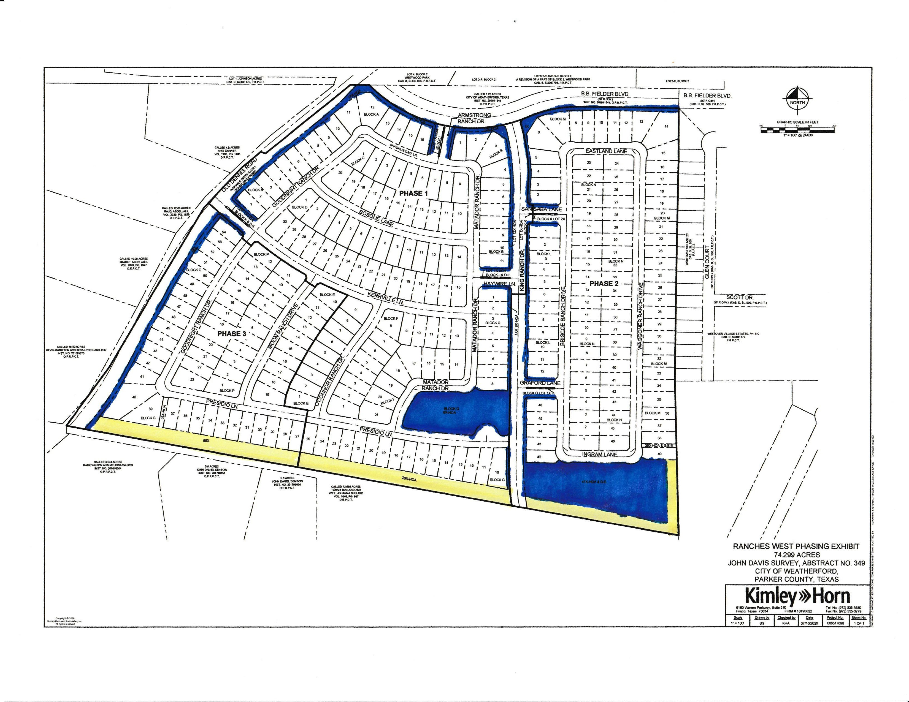

# Ranches West HOA Landscaping SOW

## Scope of Work
The HOA Common area is divided into two categories for landscaping purposes:
- **Irrigated Areas**: Shown on the map in Blue.
- **Non-Irrigated Areas**: Shown on the map in Yellow.

### Mowing, Edging, and Blowing
- **Irrigated Areas**
  - Mowed at least **42 times per year**.
    - 32 times during the peak growing season (March - September)
    - 10 times during the off season (October - February)
- **Non-Irrigated Areas**
  - Mowed at least **6 times per year**.
  - A quoted price for each additional mow, in excess of the included 6 mows, shall be provided.
  - Grass shall be kept less than 10" at all times per city ordinance.

### Removal of Organic Debris (leaves, small downed branches, dead plants)
- **Irrigated Areas**
  - At least once **every other week**.
- **Non-Irrigated Areas**
  - As needed to prevent damage to mowers.

### Prompt Removal of All Litter, Trash, Refuse, and Wastes
- **Trash Bins**: 4 bins (3 at the park, 1 at the pond)
  - Cleared **every mowing session** **AND** at least **once every other week**.

### Pruning/Shearing of Shrubs and Ground Cover
- **Irrigated Areas**
  - As needed.
- **Non-Irrigated Areas**
  - Out of scope.

### Annual Tree Trimming (and as needed for sidewalk clearance)
- **Irrigated Areas**
  - Currently out of scope as trees are not mature enough.
- **Non-Irrigated Areas**
  - Out of scope.

### Application of Fertilizer
- **Irrigated Areas**
  - 4 times per year.
- **Non-Irrigated Areas**
  - Out of scope.

### Weed Control
- **Irrigated Areas**
  - Manually and mechanically/chemically controlling weeds with post-emergent weed killer as required to maintain a reasonably manicured appearance.
  - Pre-emergent weed killer should be applied **4 times per year**.
- **Non-Irrigated Areas**
  - Out of scope.

### Fire Ant Control
- **Frequency**
  - Controlling fire ants in turf areas with chemical control agents as necessary when ant mounds are visible; **OR** as directed by the board.

### Mulching Beds and Tree Wells
- **Frequency**
  - Mulch should be reapplied at least **twice per year**.
- **Color**
  - Mulch for flower beds and tree wells shall be Black unless approved in advance by the board.

### Periodic Irrigation Checks 
- **Frequency**
  - Performed on a **monthly basis**.
- **Requirements**
  - Inspect all irrigation zones to ensure proper functioning of sprinkler heads, valves, and controllers.
  - Adjust sprinkler heads for proper coverage and alignment to prevent over-spraying onto sidewalks, streets, or non-landscaped areas.
  - Test all valves and controllers to ensure proper timing and functionality.
  - Check for any leaks or damage in the irrigation lines and report issues immediately.
  - Ensure all irrigation schedules comply with current watering restrictions or board directives.
- **Deliverable**
  - Provide a written report after each inspection detailing the condition of the system, any repairs or adjustments made, and any recommendations for future maintenance or repairs. 
  - Reports should be submitted to the board within 3 days of the inspection.
